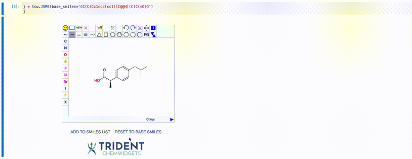
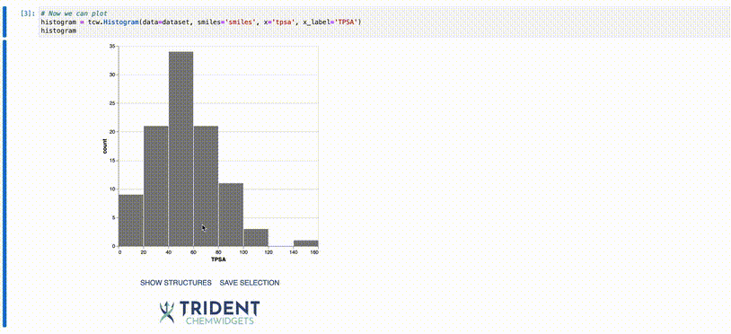
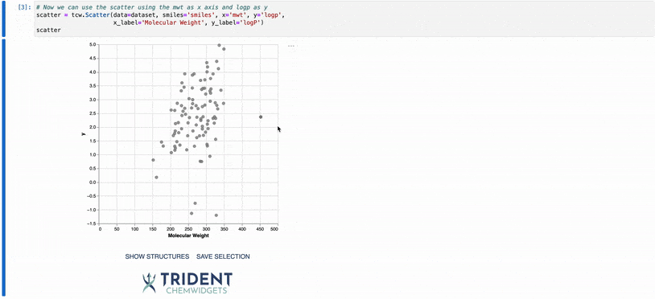
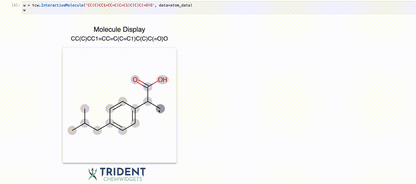

<br/><br/>

<div align="center">
    
</div>

<br/>   

<!-- <h1 align="center">Trident Chemwidgets</h1> -->


## Summary

- [About](#About)
- [Installation](#Installation)
- [Documentation](#Documentation)
- [Usage](#Usage)
<!-- - [Tests](#Tests) -->
<!-- - [Roadmap](#Roadmap) -->


## About

The Trident Chemwidgets (TCW) package provides a set of Jupyter widgets to improve data visibility in cheminformatics and molecular machine learning. 

Trident Chemwidgets is a product of Trident Bioscience. Trident Bioscience builds machine learning applications for the biotech and pharmaceutical industries. If you're interested in learning more, you can visit us at [trident.bio](https://www.trident.bio) or email us at [info@trident.bio](mailto:info@trident.bio).

## Installation

Trident Chemwidgets is available from pip and conda:

pip:
```bash
pip install trident-chemwidgets
```

conda:
```
conda install -c conda-forge trident-chemwidgets
```

Then, for Jupyter Lab, run:

```
jupyter labextension install trident-chemwidgets
```

[Full instructions here.](https://www.trident.bio/trident-chemwidgets/html/installing.html)

## [Documentation](https://www.trident.bio/trident-chemwidgets)

Click the link above to access the [documentation](https://www.trident.bio/trident-chemwidgets). If you're looking for example notebooks, check out the links below (clone this repository to use them directly).

- [JSME widget](/examples/JSME_widget.ipynb)
- [Histogram widget](/examples/Histogram_widget.ipynb)
- [Scatter widget](/examples/Scatter_widget.ipynb)
- [InteractiveMolecule widget](/examples/InteractiveMolecule_widget.ipynb)

## Usage

We suggest importing Trident Chemwidgets using the convention `tcw`, as shown below. 

```python
import trident_chemwidgets as tcw
```

---

### Input functions

#### JSME

To facilitate molecular input, TCW provides an interface to the [JSME Molecule Editor](https://jsme-editor.github.io/) with added functionality.

```python
editor = tcw.JSME()
editor
```

<div align="center">
    
</div>

You can play with JSME widget in this [notebook](/examples/JSME_widget.ipynb).

---

### Plotting functions

Understanding the distribution of your data is critical to many cheminformatic tasks. To this end, we supply a number of interactive plotting functions that allow you to display both the data and underlying molecular structures. You can even subset and save the data based on the property values for use in downstream analysis.

#### Histogram

For 1-dimensional datasets, TCW provides a histogram plot function:

```python
histogram = tcw.Histogram(data=data, smiles='smiles', x='tpsa', x_label='TPSA')
histogram
```

<div align="center">
    
</div>


You can play with Histogram widget in this [notebook](/examples/Histogram_widget.ipynb).

#### Scatter plot

For 2-dimensional datasets, TCW provides a scatter plot function:

```python
scatter = tcw.Scatter(data=data, smiles='smiles', x='mwt', y='logp',
                      x_label='Molecular Weight', y_label='logP')
```

<div align="center">
    
</div>


You can play with Scatter widget in this [notebook](/examples/Scatter_widget.ipynb).

---

### Output functions

#### Interactive molecule

To examine features at the atom level, TCW provides a function to plot a molecule and allow users to explore the atom-specific features:

```python
mol = tcw.InteractiveMolecule('CC(C)CC1=CC=C(C=C1)C(C)C(=O)O', data=atom_data)
mol
```

<div align="center">
    
</div>


You can play with InteractiveMolecule widget in this [notebook](/examples/InteractiveMolecule_widget.ipynb).
