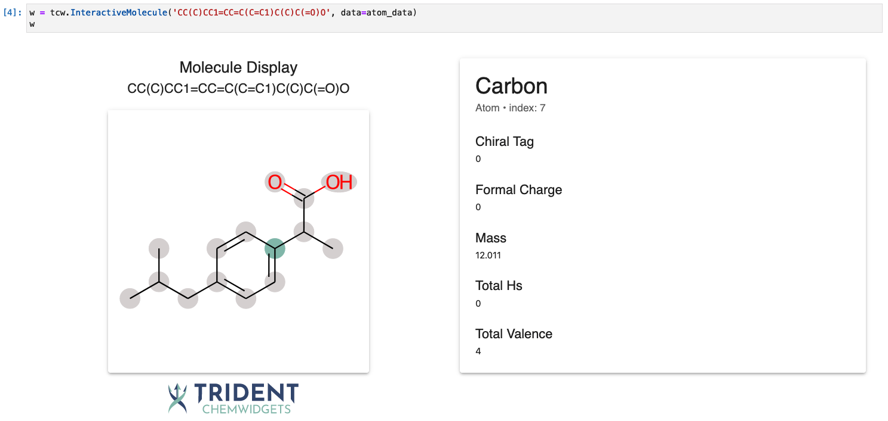

# InteractiveMolecule

```{eval-rst}
.. autoclass:: trident_chemwidgets.InteractiveMolecule
   :show-inheritance:
```

## Input data structure

The input for this widget can either be a list of dictionaries, with each dictionary containing the features of the atoms, or it can be a Pandas DataFrame.
In either case, *the ordering of the dictionaries in the list or the rows in the dataframe must match the standard ordering used by RDKit*.

If you are using a standard RDKit-based featurizer, as is common in many ML for chemistry packages (e.g. [DeepChem](https://deepchem.readthedocs.io/en/latest/api_reference/featurizers.html#molgraphconvfeaturizer)), this ordering should be the default.
We cannot guarantee ordering for all featurizers/applications, so it is always a good idea to double check your atom ordering against that generated with the `GetAtoms` function in RDKit.

## Interaction features



### Atom information

Click within the circle surrounding each atom in the structure to display the data associated with that atom.

## Example
 
See [Using the InteractiveMolecule widget](../examples/InteractiveMolecule_widget.ipynb).